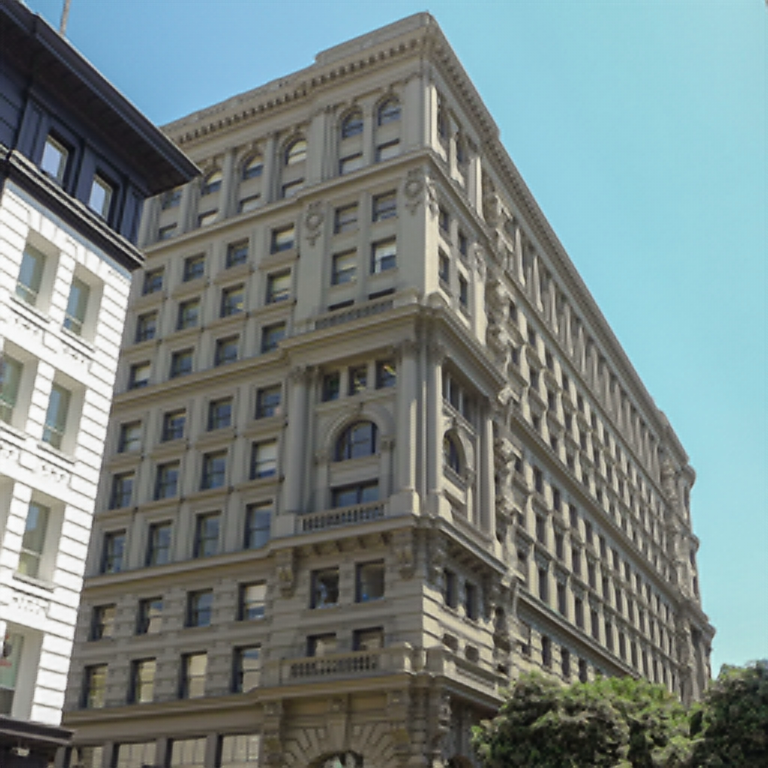

# SuperRes-ESPCN

A PyTorch implementation of single image super-resolution with a
sub-pixel convolutional neural network (ESPCN), based on CVPR 2016
paper [Real-Time Single Image and Video Super-Resolution Using an
Efficient Sub-Pixel Convolutional Neural
Network](https://arxiv.org/abs/1609.05158). A few details are also
inspired by this [ESPCN
implementation](https://github.com/leftthomas/ESPCN).

## Requirements

- tested with python 3.11.7
- [Anaconda](https://www.anaconda.com/download/)
- [PyTorch](https://pytorch.org)
```
conda install pytorch torchvision
```
- [TensorBoard](https://www.tensorflow.org/tensorboard)
```
conda install -y -c conda-forge tensorboard
```
- [OpenCV](https://opencv.org)
```
conda install -c conda-forge opencv
```

## Pre-trained models

Pre-trained models are in directories `models`. `x3` stands for upscale factor 3, `x4` stands for upscale factor 4.

* `model-x3-coco-l3-stanh.pth`

  This model performs upscale factor 3. It is the original 3-layers,
  Tanh activation function, final sigmoid, and has been pre-trained on
  COCO dataset, with 57 epochs, batch_size 128. Final PSNR was 24.42
  dB, compared to 23.8771 dB with bicubic interpolation.

* `model-x4-coco-l3-stanh.pth`

  This model performs upscale factor 4.  It is the original 3-layers,
  Tanh activation function, final sigmoid, and has been pre-trained on
  COCO dataset, with 31 epochs, batch_size 64.  Final PSNR was 23.2711
  dB, compared to 22.4715 dB with bicubic interpolation.

## Usage

### Single image super-resolution

```
python sr-image.py
usage: sr-image.py [-h] --input_image INPUT_IMAGE --model MODEL
                   [--output_filename OUTPUT_FILENAME]
```

The upscale factor is determined by the given model.

You can also use `interp-image.py` to do super-resolution with a
standard interpolation function (NEAREST, BILINEAR, BICUBIC).

```
python3 interp-image.py
usage: interp-image.py [-h] --input_image INPUT_IMAGE [--interpolation INTERPOLATION]
                       [--upscale_factor UPSCALE_FACTOR]
                       [--output_filename OUTPUT_FILENAME]
```

<table>
<tr>
<td> <b> Original </b> </td>
<td> <b> ESPCN </b> </td>
<td> <b> BICUBIC </b> </td>
<td> <b> BILINEAR </b> </td>
<td> <b> NEAREST </b> </td>
</tr>
<tr>
<td>  </td>
<td>  </td>
<td>  </td>
<td>  </td>
<td>  </td>
</tr>
</table>
<table>
<tr>
<td> <b> Original </b> </td>
<td> <b> ESPCN </b> </td>
<td> <b> BICUBIC </b> </td>
<td> <b> BILINEAR </b> </td>
<td> <b> NEAREST </b> </td>
</tr>
<tr>
<td>  </td>
<td>  </td>
<td>  </td>
<td>  </td>
<td>  </td>
</tr>
</table>
<table>
<tr>
<td> <b> Original </b> </td>
<td> <b> ESPCN </b> </td>
<td> <b> BICUBIC </b> </td>
<td> <b> BILINEAR </b> </td>
<td> <b> NEAREST </b> </td>
</tr>
<tr>
<td>  </td>
<td>  </td>
<td>  </td>
<td>  </td>
<td>  </td>
</tr>
</table>

### Video camera super-resolution

```
python3 sr-video.py
usage: sr-video.py [-h] --model MODEL
```

This script opens your camera, sets its resolution to 1280x720, then
let you downsample the stream and choose your super-resolution
method. You may use the following keys:

```
- 'q': quits
- '0': no down-sampling
- '1': one downsampling, then one super-resolution
- '2': two downsamplings, then two super-resolutions
- 's': super-resolution with ESPCN
- 'n': super-resolution with nearest-neighbor interpolation
- 'l': super-resolution with bilinear interpolation
- 'c': super-resolution with bicubic interpolation
- '+': zoom-in
- '+': zoom-out
```

It displays PSNR in real-time.

## Datasets

We use [COCO](https://cocodataset.org/#home) dataset for training,
then BSDS300 plus 100 random images from COCO test dataser for
testing.

## Training

By default, it trains on
[BSDS300](https://www2.eecs.berkeley.edu/Research/Projects/CS/vision/bsds/)
dataset. You may switch to another dataset by specifying a path to a
dataset. We have use COCO here.

**Upscale factor 3**

```
python train.py --upscale_factor 3 --nEpochs 1000 --train_with_coco True --run_name "stanh" --batchSize 128
```

It took approximatively 55 minutes per epoch on MacBook Pro, M2 Max
chip, GPU 30 cores, with metal 3 device (mps) for COCO with batch size
128.


> Loss/PSNR graphs

<table>
<tr>
<td> <b>Epoch average training loss</b> </td>
<td> <b>Epoch average test PSNR</b> </td>
</tr>
<tr>
<td>  </td>
<td>  </td>
</tr>
</table>

**Upscale factor 4**

```
python train.py --upscale_factor 4 --nEpochs 1000 --train_with_coco True --run_name "stanh" --batchSize 64
```


It took approximatively 28 minutes per epoch on MacBook Pro, M2 Max
chip, GPU 30 cores, with metal 3 device (mps) for COCO with batch size
64.

> Loss/PSNR graphs

## Remarks

### On the original model

The original paper does not specify that there is a Sigmoid activation
after the last convolution. Adding it improved the training phase.

### Comparison between ReLU and Tanh activation

We have tried several variations in the number of convolution layers
and activation functions, for `u` the upscale_factor.

* Chosen model
```
Sequential(
   Conv2d(1,  64,  (5, 5), (1, 1), (2, 2)), Tanh,
   Conv2d(64, 32,  (3, 3), (1, 1), (1, 1)), Tanh,
   Conv2d(32, u*u, (3, 3), (1, 1), (1, 1)), Tanh,
   PixelShuffle, Sigmoid
   )		 
```

* Use ReLU instead of Tanh
```
Sequential(
   Conv2d(1,  64,  (5, 5), (1, 1), (2, 2)), ReLU,
   Conv2d(64, 32,  (3, 3), (1, 1), (1, 1)), ReLU,
   Conv2d(32, u*u, (3, 3), (1, 1), (1, 1)), ReLU,
   PixelShuffle, ReLU
   )		 
```

Training fails completely, and performance is stalled at 13dB.

* Use 4 layers instead of 3 layers, and ReLU instead of Tanh
```
Sequential(
   Conv2d(1,  64,  (5, 5), (1, 1), (2, 2)), ReLU,
   Conv2d(64, 64,  (3, 3), (1, 1), (2, 2)), ReLU,   
   Conv2d(64, 32,  (3, 3), (1, 1), (1, 1)), ReLU,
   Conv2d(32, u*u, (3, 3), (1, 1), (1, 1)), ReLU,
   PixelShuffle
   )		 
```

Model was competitive with the chosen model (3 layers, Tanh +
Sigmoid), on the BSDS300 database.

We did not try to train it with COCO, but it could be an option.

> Using Tanh instead of ReLU was blocking training at 19dB.

### Using Batch normalization and DropOut

Adding batch normalization and/or DropOut at each layer, before or
after convolution, or at first or last layer, was slowing learning and
performance was worse for a small dataset, as well with several
iterations on COCO.


